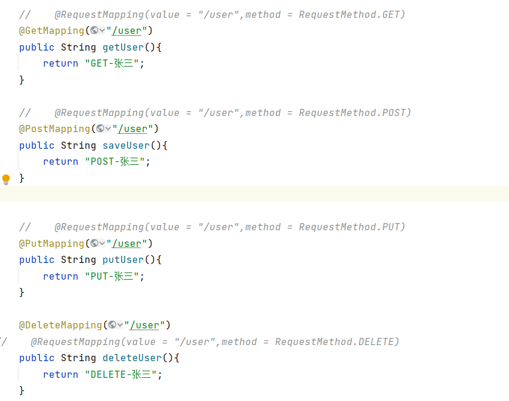

图1:

restful风格的请求，get表示查看、post表示新增、put表示修改，
delete表示删除

图1中，@GetMapping和它上面注释掉的那一行的作用是相同的。
同理，@PostMapping、@PutMapping、@DeleteMapping各自的作用
和它们上面的被注释掉的相同。

图2：

前端页面请求restful接口，需要写成这样，针对delete请求和put请求，
不能用form标签的method属性等于delete或者put，需要用
隐藏域_method这种方式

图3: 

同时，springBoot的配置文件中还要加上图3这个配置项，这个配置项在springBoot
底层默认是false，需要改为true,然后页面才能正常访问restFul接口。否则，如果不加这个
配置，restful接口，可以被postman等工具调用，不能被前端页面调用。
如果restful接口，只是提供给其他服务调用的，不是前端页面调用，这个配置项可以不改。

图4：

图5：

在springBoot底层，用来请求restful接口的参数是_method,这个值可以在
通过图4中，修改为别的值，图4是改成了_m
