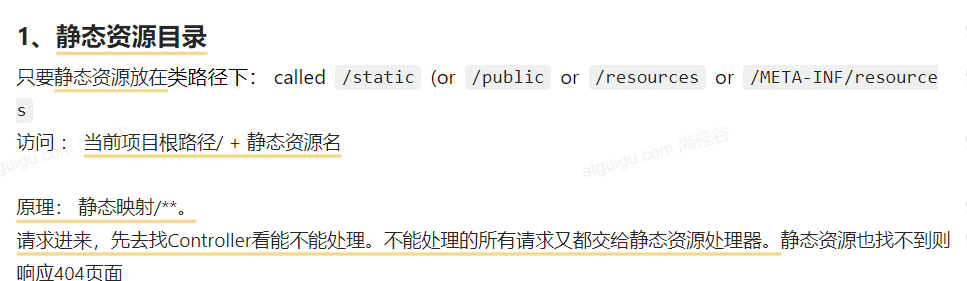
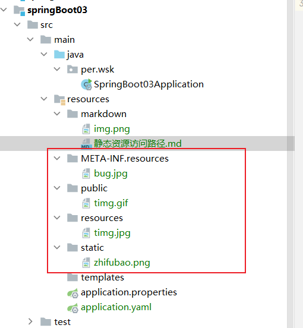
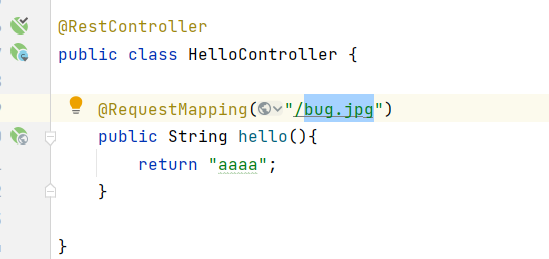

图1:

图2 :

图3:

上面三张图说明了: springBoot内置的规定，在resources下面
新建public、resources、static、META-INF.resources这几个名字
的文件夹，里面放的静态资源，项目访问时直接就是：

服务名后面 直接跟上 要访问的资源名，就能访问到该静态资源。
前提是该资源必须放到上面几个名字的文件夹内。

图4:

图5:

