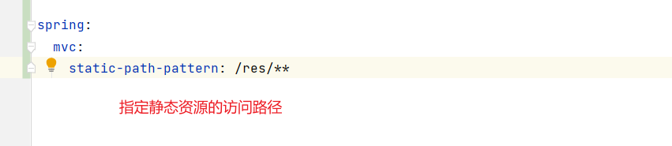

图1:

图2 :

图3:

上面三张图说明了: springBoot内置的规定，在resources下面
新建public、resources、static、META-INF.resources这几个名字
的文件夹，里面放的静态资源，项目访问时直接就是：

服务名后面 直接跟上 要访问的资源名，就能访问到该静态资源。
前提是该资源必须放到上面几个名字的文件夹内。

图4:

图5:

此时访问bug.jpg就不再是访问图片，而是访问动态接口
上面图4和图5说明: spirngBoot会先拿着访问路径去寻找动态资源，没找到
才会去找静态资源

默认情况下，访问静态资源，访问地址是项目地址后面直接跟资源名就行。
可以手动指定静态资源的访问路径，图6中表示所有静态资源的访问，
在项目路径下都要加上/res这个名称，这么做是为了在项目中，对所有的动态
请求和静态请求做统一的区分。
图6:

图7:

